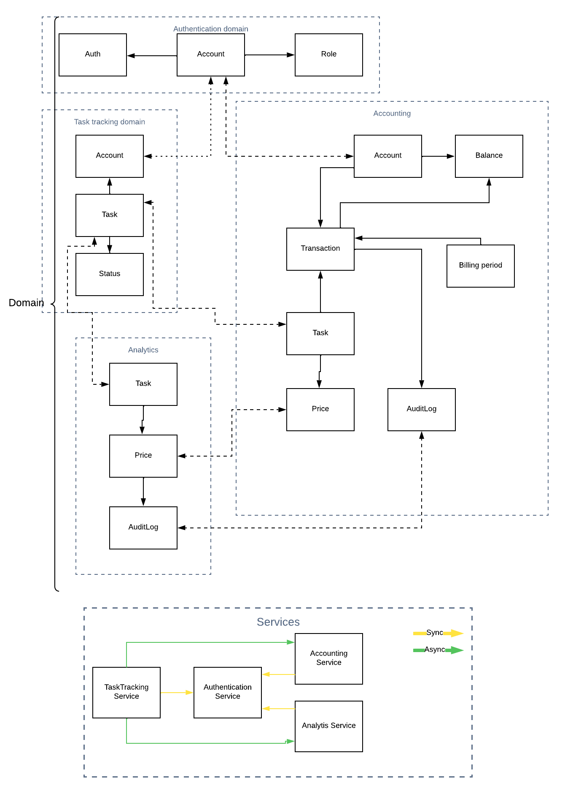

### Domains:

- Auth domain (create, update, delete user and change role)
- Task tracking domain (create, update, assign task)
- Accounting domain (set price for a task, calculate result, create auditlog)
- Analytics domain

### Services:

- Auth service (Auth)
- Task tracking service (Tsk)
- Accounting service (Acc)
- Analytics service (Anl)

### Events

| Event | Type | Producer | Consumer |
|-------|------|----------|----------|
|Account.logined| BE| Auth | Tsk/Acc/Anl |
| Task.added | BE | Tsk | Acc |
| Task.assigned | BE | Tsk | Acc |
| Task.completed | BE| Tsk | Acc |
| Price.created | CUD | Acc |Anl |
| AuditLog.created |CUD|Acc |Anl |
| Payment.made |BE |Acc| Acc|
| Notification.sent |BE | Acc| |

### Required data

***Accoun***
- id (int)
- name (string)
- email (string)
- balance (integer)

***Task***
- id (int)
- description (text)
- account_id (int)
- status (enm)

***Price***
- id (int)
- price_assignment (int)
- price_compeliton (int)
- task_id

***Transaction***
- id (int)
- task_id (int)
- account_id (int)
- debit (int)
- credit (int)

***AuditLog***
- id (int)
- tranaction_id (int)
- account_id (int)
- sum (int)
- description (string)

***Billing Periond***
- id (int)
- start_date (date)
- end_date (date)

